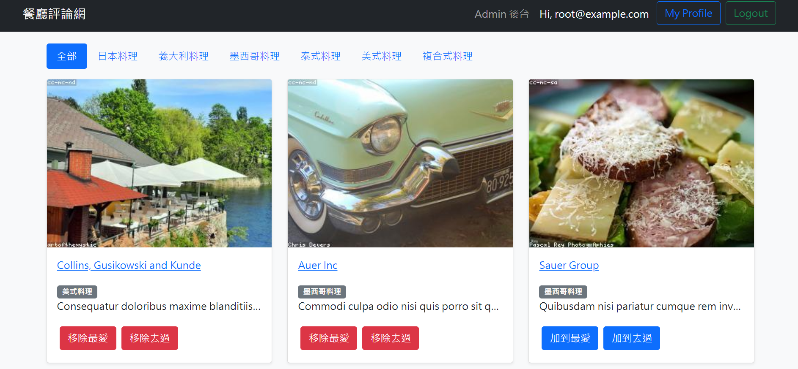
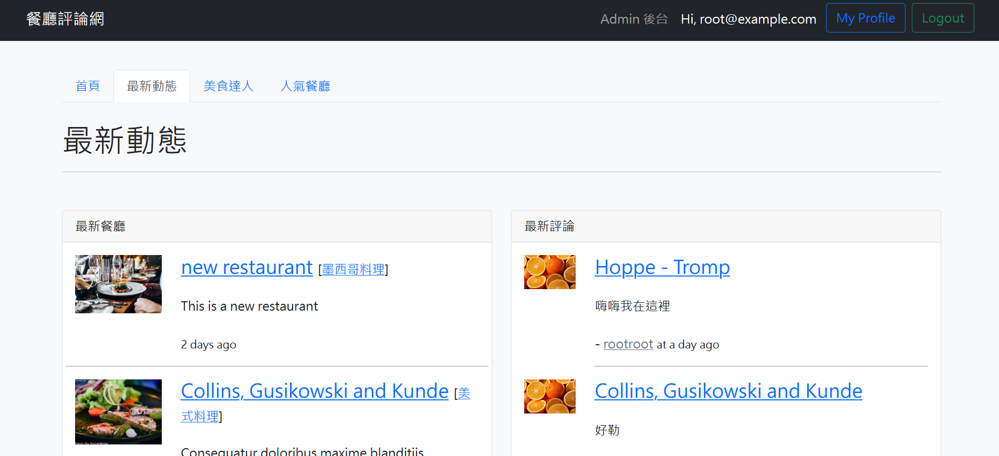
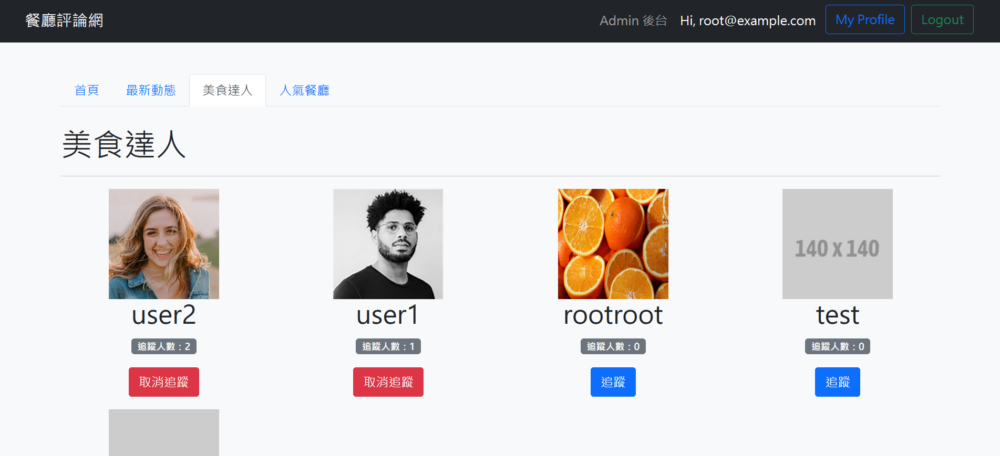
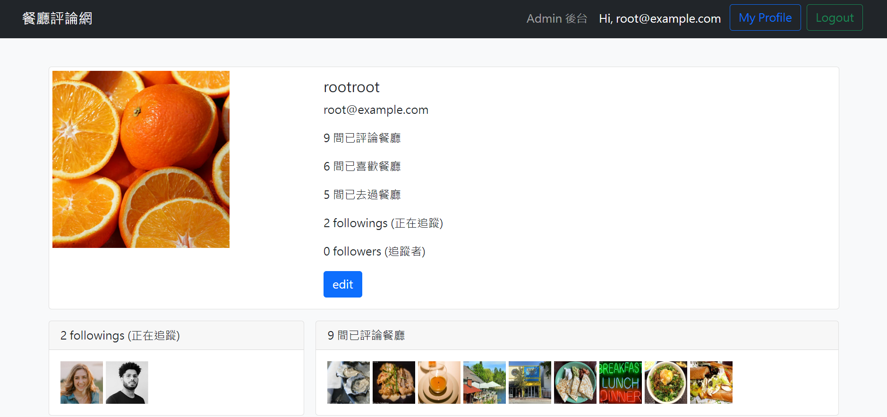
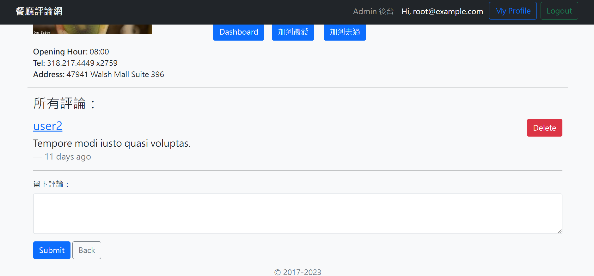
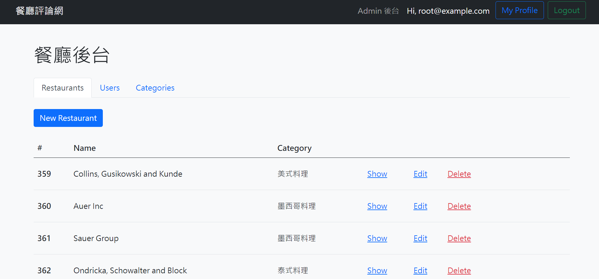
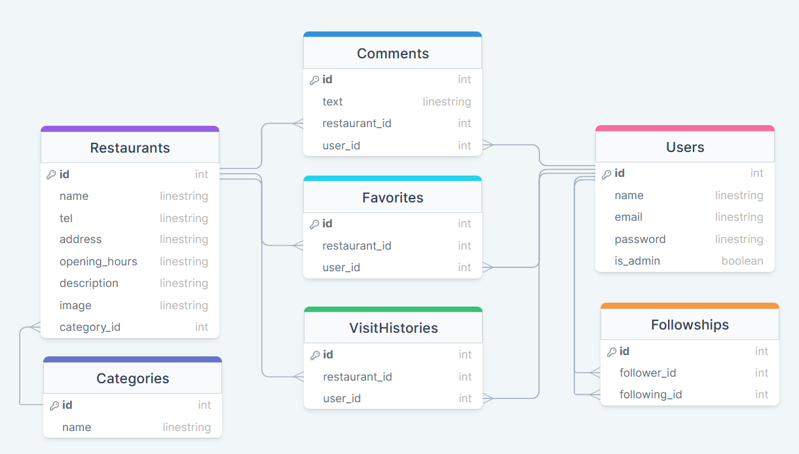

# Restaurant Forum

## 💡 Overview

An MVC restaurant forum app where users can explore various restaurants and interact with other users. Built with express.js, sequelize, mySQL and handlebars.

### 👀 Screenshots

Users can view restaurants according to categories, add them to favorites and mark them as "visited".



Users can view latest feeds of restaurants and comments.



Users can view popular users list.





Users can leave comments on restaurants page.



#### Admin Dashboard

Admin users can manage restaurant data, user authorization settings and categories.



### ⚙️ Features

- Users can login or create a new account
- Users can view all the restaurants or filter them according to categories
- Users can add restaurants to their favorites and mark them as "visited"
- Users can follow other users
- Users can view all restaurants marked as "favorite" or "visited" as well as following status in their profile
- Users can manage their user name and profile image

#### Admin features

- Admin users can create, edit and delete all restaurants data
- Admin users can change other users authorization settings
- Admin users can create, edit and delete categories data

### ERD (Entity Relationship Diagram)



## 🚀 Run Locally

1. Clone this repo to your local environment

```bash
$ git clone "https://github.com/KellyCHI22/restaurant-forum.git"
```

2. Install necessary packages

```bash
$ npm install
```

3. Create your `.env` file, see `.env.example` for more details

4. Set up your own MySQL settings in `config/config.json`

```json
"development": {
    "username": "<user name>",
    "password": "<user password>",
    "database": "<database name>",
    "host": "127.0.0.1",
    "dialect": "mysql"
  }
```

5. Run migration files and load seed data

```bash
$ npx sequelize db:migrate
$ npx sequelize db:seed:all
```

6. Run this command to start the server

```bash
$ npm run dev
```

6. When you see this message, you can enter the following url in your browser: `http://localhost:3000`

```bash
App is running on http://localhost:3000
```

7. If you want to use testing accounts, please enter the following email and password

```
// normal user
email : user1@example.com
password : 12345678

// admin user
email : root@example.com
password : 12345678
```

8. Enter the following command to stop the server

```bash
ctrl + c
```

## 💻 Technologies

- node.js 18.17.0
- express 4.17.1
- express-handlebars 5.3.3
- express-session 1.17.2
- bcryptjs 2.4.3
- dayjs 1.10.6
- jsonwebtoken 8.5.1
- method-override 3.0.0
- multer 1.4.3
- passport 0.4.1
- passport-jwt 4.0.0
- passport-local 1.0.0
- sequelize 6.6.5
- sequelize-cli 6.2.0
- connect-flash 0.1.1
- Bootstrap 5.0.2
- faker-js/faker 8.0.2
